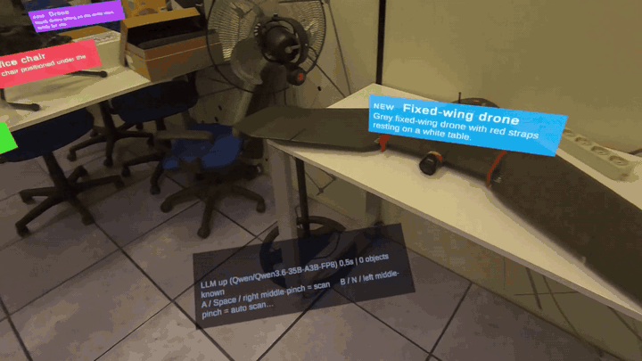

# Document Your Reality

MR labels written by a vision model, **attached to real objects**, that **come back** when the
same object is seen again.

One frame in, labels out. In a single call the model **detects** the objects with their bounding
box, **re-identifies** the ones already documented, and **documents** each one with a short MR
title and an operational description.

It works the same from an **mp4 file** (no headset) and from the **Quest 3 / 3S passthrough
camera**: only where the label ends up changes. The source is chosen **at runtime**, so one build
covers both cases.



---

## What you need

| | |
|---|---|
| **PC** | Python 3.11+ with [`uv`](https://docs.astral.sh/uv/), on the same Wi-Fi as the headset |
| **Model** | a vision model **with grounding** (it can say *where* objects are) behind an OpenAI-compatible API. Served by vLLM, Ollama, LM Studio or OpenAI |
| **Headset** *(optional)* | Meta Quest 3 or 3S. Without one, video mode is used instead |
| **Unity** | Unity 6000.3 LTS+ and the Meta XR SDK, see [In Unity](#in-unity) |

**The APK and the Unity project are not in this repository**: they exceed GitHub's limits (the
project zip is around 4.7 GB) and are distributed separately. To get them, **contact us**.

---

## Running it

```bash
uv sync
uv run dyr-backend        # port 8000
```

In order: **1)** the model server → **2)** the backend → **3)** the client.

At startup the backend prints the addresses to use: `http://127.0.0.1:8000` from the same PC and
`http://<LAN-IP>:8000` from the headset. Swagger at `/docs`, and
`GET /llm/health?probe=true` tells an unreachable endpoint from a model that is loaded but does
not generate.

---

## In Unity

Import the C# scripts and `StreamingAssets/`, then **`Tools > DYR > Create Scene`**. One scene
covers every mode, picked from the `Mode` dropdown on `DyrScanLoop`.

Packages, from the Package Manager:

| Package | Version used | For |
|---|---|---|
| `com.meta.xr.sdk.all` | 203.0.0 | the Meta XR SDK; pulls in MRUK (`com.meta.xr.mrutilitykit`), which is what labels land on |
| `com.unity.xr.openxr` | 1.16.1 | the XR runtime |
| `com.unity.render-pipelines.universal` | 17.3.0 | URP |
| `com.unity.inputsystem` | 1.19.0 | controller and keyboard input |

TextMesh Pro (`com.unity.ugui`) ships with the editor. For the headset, enable the Meta build
path with **`Tools > DYR > Enable Meta Support`**.

**Without a headset** the project runs on the PC: `Video` plays `test.mp4` and needs no XR at
all, and `Vr` walks a virtual room under the
[Meta XR Simulator](https://developers.meta.com/horizon/downloads/package/meta-xr-simulator/),
a standalone app to install separately (Windows and Mac; the old Unity package is deprecated).
**Passthrough is the one mode that needs the headset itself.**

`Auto` picks passthrough on a headset and the video everywhere else, so for the virtual room set
`Mode = Vr` by hand.

---

## On the headset

**1. Install the APK.** Sideloaded apps do not appear in the normal library: they live in
**App Library → Unknown Sources**. Either open a download link in the headset browser and install
from **Files → Download**, or over a USB **data cable**:

```bash
adb install -r DocumentYourReality.apk
```

**2. Scan the room.** **Settings → Environment → Space Setup**, looking slowly at every surface.
This produces the *global mesh*, which is what the labels land on. Without it they hang in
mid-air at a fixed distance. It does not update itself: after moving furniture, run it again.

**3. Open TCP 8000 and UDP 8001** in the PC firewall, then start the model server and the
backend, in that order and **before** the app. No IP address to type in: the app broadcasts a UDP
datagram on port 8001 and the backend answers with its own address. If the network blocks
broadcasts (common on corporate or university Wi-Fi), a phone hotspot solves it.

**4. Grant the camera permission** on first launch. Without it the app cannot work.

| Controller | Hands | Keyboard | Action |
|---|---|---|---|
| **A** | thumb + right **middle** finger | `Space` / `3` | Scan now |
| **B** | thumb + left **middle** finger | `N` / `4` | Toggle automatic scanning |
| **Y** | thumb + **ring** finger | `L` | Show/hide the log |

The thumb + **index** pinch is the system click, and is left to the headset menus. The floating
panel shows the active mode, the labels in view, the model status and any errors; the log is read
inside the app, because Quest scoped storage keeps the file manager from opening log files.

---

## API

| Endpoint | What it does |
|---|---|
| `POST /scan/stream` | **The main endpoint.** One frame, and the labels come back as NDJSON one at a time while the model writes: `{"t":"label",...}` per object, then `{"t":"done",...}`. It is the difference between the first label at 2s and at 20s |
| `POST /scan` | same frame, but all the labels together once generation ends |
| `GET /objects` | everything known, to restore labels at the start of a session |
| `POST /objects/reset` | forget everything, in memory as well as on disk. Deleting the JSON files by hand does **not** work while the backend is running |
| `POST /objects/{id}/anchor` | the client reports where it anchored an object: this is what makes a label survive the session |
| `GET /health` · `GET /llm/health?probe=true` | system and model status |

Only **one frame at a time** is analysed: the client scans on a timer, and a slow model would
otherwise stack up requests that all time out. Extra frames are refused immediately.

---

## How it works

The client grabs a frame and posts it to the backend, which asks the model one question:
what is in this picture, which of these objects have you already documented, and what should
each label say. Known objects travel with the request as cues, so the model answers with the
`entity_id` of the ones it recognises. There are no embeddings and no vector database: an object
gets its label back because it was recognised in the same call that describes it.

The backend keeps a distilled memory per object (a summary, the stable facts, the open points)
and stores where the client anchored each label, which is what makes a label survive the session.
The client places the labels on the room geometry and picks its own frame source at runtime:
passthrough if the headset offers it, the video otherwise.

### Why one call, streamed

Asking for the box and the write-up in the same request measured better than splitting them in
two, so that is what the pipeline does. Streaming the reply costs nothing and is what makes the
first label appear in under three seconds instead of after twelve.

| Strategy | Objects | First label | Total | Tokens |
|---|---|---|---|---|
| Two separate calls | 6.9 | 14.0 s | 14.0 s | 969 |
| Single call | 6.3 | 12.5 s | 12.5 s | 884 |
| Single call, streamed | 6.3 | **2.7 s** | 12.5 s | ~632 |
| Streamed, hung up at 5 objects | 5.0 | **2.7 s** | **10.1 s** | ~506 |

Qwen3.6-35B on vLLM, 10 frames from `test.mp4`, both strategies asked for the same fields; they
agreed on 83% of the objects found. Rerun it with `python benchmark/run.py`.

---

## Configuration

`config.yaml`, the `scan` section:

| Key | What it controls |
|---|---|
| `max_objects_per_frame` | how many objects the model may report per frame: the latency dial |
| `known_objects_char_budget` | how many known objects are fed back as cues: **this is what makes labels reappear**, so whatever is left out cannot be recognised |
| `min_seconds_between_annotations` | how often a known object may be documented again |

There is no confidence threshold: every model asked answered 0.95 to everything. What rejects a
bad detection is `ObjectBox.is_valid()`, which needs the box to cover about 2% of each side.

The `llm` section: `scan_constrained` constrains the reply to the `ScanResult` schema
(server-side structured output). It needs `disable_thinking`; measured on Qwen3.6, the stream
stays incremental.

A `.env` next to `config.yaml` overrides endpoint and model without touching the YAML: copy
`.env.example`. `DYR_LLM_DISABLE_THINKING=1` is required on reasoning models: without it they
spend the whole token budget "thinking" and return empty content.

---

## Layout

```
config.yaml                  # model, storage, scanning, memory
prompts/                     # scan.j2 (detect + re-identify + document), memory.j2
src/document_reality/
  main.py                    # FastAPI: /scan, /scan/stream, /objects, /objects/{id}/anchor
  scanner.py                 # identity resolution and the scan cycle
  llm_client.py              # OpenAI-compatible client, streaming + partial-JSON scanner
  discovery.py               # answers a headset asking where the backend is (UDP 8001)
  schemas.py                 # ObjectBox, Entity, ScanDetection, ObjectLabel
  storage.py                 # file-backed store: objects, observations, anchors
  context.py                 # memory cues and char-budgeted context
unity/                       # the client's C# scripts + StreamingAssets/test.mp4
benchmark/                   # the scan-strategy comparison, frames and prompts included
data/                        # objects, observations, captured frames (JSON + JPEG)
```

The Unity client is organised by mode: `Core/` (driver, HTTP client, label placement, logging),
`MR/` (spatial anchors, MRUK, passthrough), `Video/`, `VR/`, `Editor/`. `Core/` knows nothing
about `VR/` or `Video/`: it only knows how to ask a source for a JPEG.
